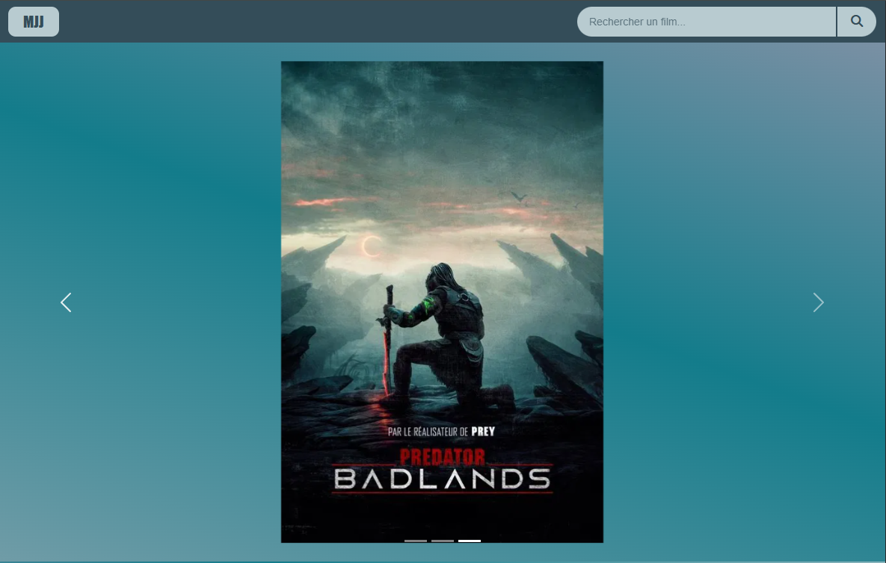
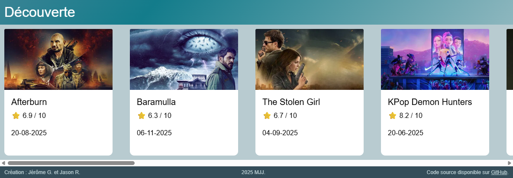
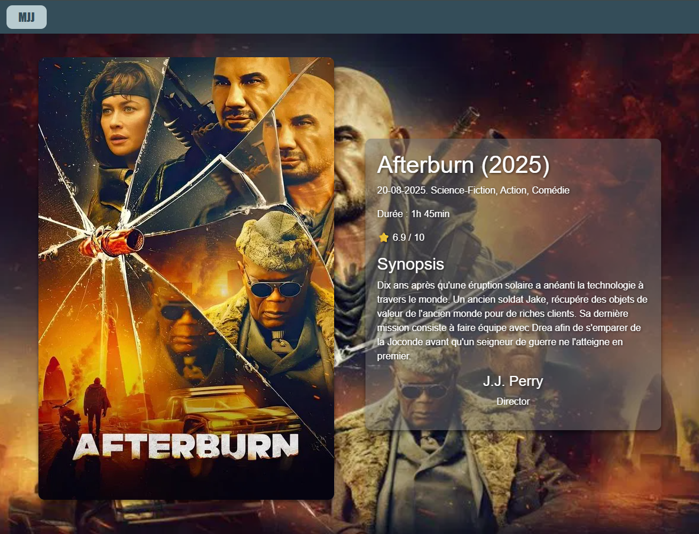
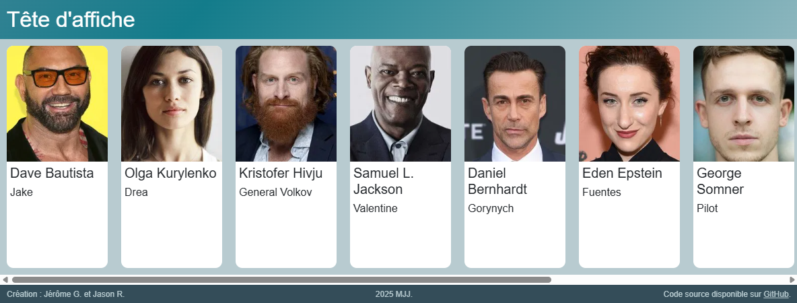

# 🎬 MJJ - Movies Database

**Un site web moderne pour découvrir et explorer des films** 🍿


## 📖 Description

MJJ est une application web interactive qui permet aux utilisateurs de découvrir des films populaires, rechercher des titres spécifiques et consulter des informations détaillées sur leurs films préférés. L'interface moderne et responsive utilise l'API The Movie Database (TMDb) pour fournir des données à jour.

## ✨ Fonctionnalités

### 🏠 Page d'accueil

- **Carrousel interactif** avec les films actuellement au cinéma
- **Barre de recherche intelligente** avec suggestions en temps réel
- **Section découverte** avec une sélection de films populaires
- **Design responsive** adapté à tous les appareils

### 🔍 Recherche avancée

- **Suggestions automatiques** dès la frappe (2 caractères minimum)
- **Aperçu des films** avec poster, titre et année
- **Navigation intuitive** vers les fiches détaillées
- **Interface épurée** sans barre de défilement visible

### 🎭 Fiche film détaillée

- **Informations complètes** : titre, date, genres, durée, note
- **Synopsis détaillé** et tagline du film
- **Cast et équipe** avec photos des acteurs
- **Background dynamique** avec l'affiche du film
- **Design immersif** et professionnel

## 🖼️ Captures d'écran

### Page d'accueil


_Interface principale avec carrousel et barre de recherche_

### Section découverte


_Section avec une sélection de films actuellement à l'affiche_

### Fiche film


_Page détaillée avec toutes les informations du film_

### Cast et équipe


_Section dédiée aux acteurs et réalisateurs_

## 🛠️ Technologies utilisées

### Frontend

- **HTML5** - Structure sémantique
- **CSS3** - Styles modernes avec Flexbox/Grid
- **JavaScript ES6+** - Logique applicative et API
- **Bootstrap 5.3** - Framework CSS responsive
- **Font Awesome** - Icônes vectorielles

### API

- **The Movie Database (TMDb)** - Base de données cinématographique
- **Fetch API** - Requêtes HTTP asynchrones
- **Async/Await** - Gestion moderne de l'asynchrone

### Fonctionnalités avancées

- **Responsive Design** - Compatible mobile, tablette, desktop
- **Progressive Enhancement** - Fonctionnalité dégradée gracieusement
- **Performance optimisée** - Chargement rapide et fluide
- **Accessibilité** - Navigation clavier et lecteurs d'écran

## 🚀 Installation et utilisation

### Prérequis

- Un serveur web local (Live Server, XAMPP, etc.)
- Navigateur moderne (Chrome, Firefox, Safari, Edge)

### Installation

```bash
# Cloner le repository
git clone https://github.com/GohanSenior/mjj.git

# Naviguer dans le dossier
cd mjj

# Ouvrir avec un serveur local
# Exemple avec Live Server (VS Code extension)
# Ou ouvrir index.html dans votre navigateur
```

### Configuration API

Le projet utilise une clé API TMDb intégrée. Pour utiliser votre propre clé :

1. Créez un compte sur [The Movie Database](https://www.themoviedb.org/settings/api)
2. Obtenez votre clé API
3. Remplacez la clé dans `js/index.js` et `js/movie.js` :

```javascript
Authorization: "Bearer VOTRE_CLE_API_ICI";
```

## 📁 Structure du projet

```Mjj
mjj/
├── 📄 index.html          # Page d'accueil
├── 📄 movie.html          # Page de détail film
├── 📁 css/
│   └── 📄 style.css       # Styles personnalisés
├── 📁 js/
│   ├── 📄 index.js        # Logique page d'accueil
│   └── 📄 movie.js        # Logique page film
├── 📁 images/
│   ├── 📄 logo.png        # Logo du site
│   ├── 📄 no-poster.png   # Image par défaut (poster)
│   └── 📄 no-avatar.png   # Image par défaut (acteur)
└── 📄 README.md           # Documentation
```

## 🎨 Fonctionnalités détaillées

### Barre de recherche

- **Gestion d'erreurs** robuste
- **Images par défaut** pour les films sans poster
- **Fermeture intelligente** des suggestions

### Carrousel

- **Navigation automatique** avec indicateurs
- **Images responsives** avec `object-fit: contain`
- **Chargement optimisé** des posters haute qualité
- **Liens directs** vers les fiches films

### Fiches films

- **Calcul automatique** de la durée (heures/minutes)
- **Formatage des dates** (JJ-MM-AAAA)
- **Gestion des genres multiples**
- **Affichage conditionnel** des informations
- **Background adaptatif** selon le film

## 👥 Équipe de développement

- **Jérôme G.** - Développeur Frontend
- **Jason R.** - Développeur Frontend

## 🐛 Signaler un bug

Si vous trouvez un bug, merci de créer une issue avec :

- Description du problème
- Étapes pour reproduire
- Navigateur et version
- Captures d'écran si possible

## 📞 Contact

- **GitHub** : [GohanSenior](https://github.com/GohanSenior), [Jasonrbt](https://github.com/Jasonrbt)
- **Site web** : [mjj](https://gohansenior.github.io/mjj/)

---

⭐ **N'hésitez pas à donner une étoile au projet si vous l'aimez !** ⭐

Développé avec ❤️ par l'équipe MJJ
